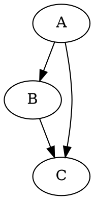
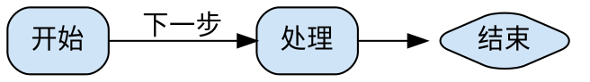
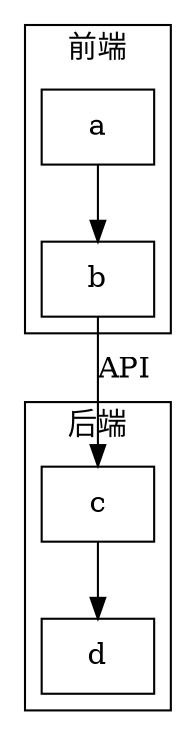

# Graphviz 图表语法与使用

Graphviz 用 dot 语言描述图，通过布局引擎把文本渲染为 SVG/PNG 图片。与 Mermaid（浏览器端 JS 渲染）不同，Graphviz 是命令行工具，需预先渲染成图片再引用。

## 1. 安装

```bash
sudo apt install graphviz   # Debian / Ubuntu
brew install graphviz       # macOS
```

- 安装后用 `dot -V` 验证版本

## 2. 基本语法：图、节点与边




- `digraph` 有向图（箭头 `->`），`graph` 无向图（连线 `--`）
- 语句以 `;` 结尾；`//` 单行注释，`/* */` 块注释
- 节点首次出现即创建，`label` 默认等于节点名

## 3. 节点与边的属性




- `node [...]` / `edge [...]` 设置全局默认；`A [key=value]` 覆盖单个节点
- 常用属性：`shape`（box/ellipse/diamond/record）、`color`、`fillcolor`、`style`、`label`
- `rankdir` 控制方向：`TB`（默认）、`LR`、`BT`、`RL`

## 4. 子图与聚类 subgraph




- 名字以 `cluster` 开头的 `subgraph` 会被画成带边框的分组
- `compound=true` 允许边连接两个 cluster

## 5. 布局引擎

| 引擎 | 布局方式 | 适用场景 |
|---|---|---|
| `dot` | 分层（有向） | 依赖图、流程图、层级结构 |
| `neato` | 弹簧模型 | 无向图、网络拓扑 |
| `fdp` | 弹簧模型（力导向） | 大图、无向图 |
| `sfdp` | 多级力导向 | 超大图（数万节点） |
| `circo` | 环形 | 循环依赖结构 |
| `twopi` | 放射状 | 星形/树形 |

## 6. 渲染为图片

```bash
dot -Tsvg input.dot -o output.svg   # SVG，矢量，推荐
dot -Tpng input.dot -o output.png   # PNG
```

- `-T` 指定输出格式（svg/png/pdf/...），`-o` 指定输出文件
- 输入可来自文件或标准输入；换引擎只需替换命令，如 `neato -Tsvg in.dot -o out.svg`

## 7. 在 Hexo 博客中使用

Graphviz 无内置渲染（与 Mermaid 不同），先本地渲染成图片再引用：

1. 用 `dot -Tsvg` 渲染为 SVG，放入文章资源目录（`post_asset_folder: true` 时为文章同名目录）
2. Markdown 中引用：

```markdown

```

## 小结

- Graphviz 用 dot 语言描述图，命令行渲染为 SVG/PNG，不依赖前端 JS
- 核心语法：`digraph`/`graph`、节点属性、`subgraph cluster_*` 聚类
- 布局引擎按场景选择：分层用 `dot`，力导向用 `neato`/`fdp`/`sfdp`
- 博客中先渲染成图片再引用（`post_asset_folder` 资源目录）
