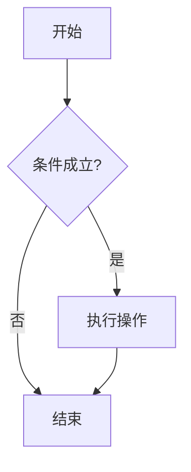
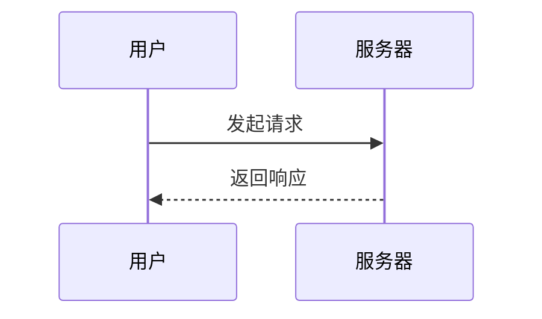
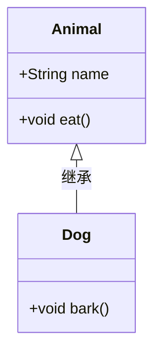
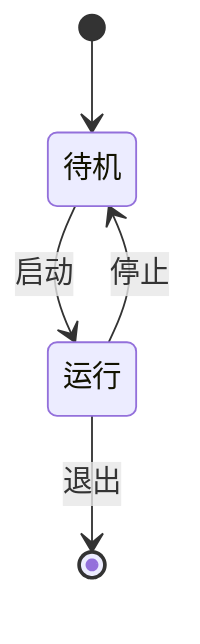
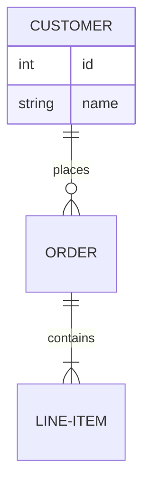
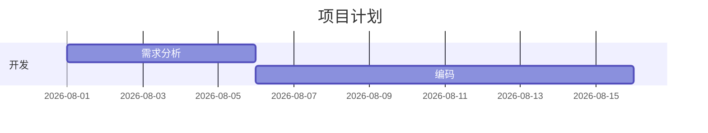
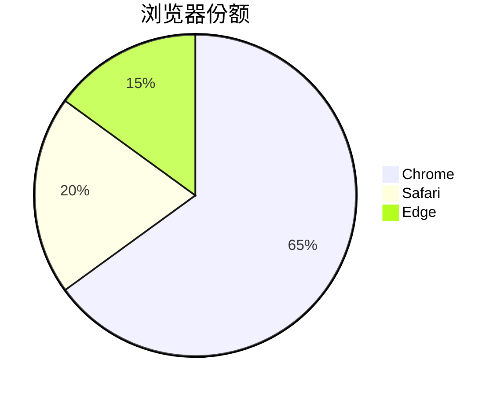

# Mermaid 图表语法与使用

Mermaid 是一种「文本转图表」的 DSL，用类 Markdown 的纯文本描述流程图、时序图、类图等，由前端 JS 渲染为 SVG。无需绘图工具，图表可随代码一起纳入版本管理。

## 1. 在 Butterfly 中启用

在 `_config.butterfly.yml` 中开启 Mermaid：

```yaml
mermaid:
  enable: true       # 全局启用（按需懒加载，无图表的页面不加载脚本）
  code_write: true   # 用 ```mermaid 代码块书写，false 则用 <div class="mermaid">
  theme:
    light: default   # 可选 default / forest / dark / neutral
    dark: dark
```

- `enable: true` 后，仅当页面存在 Mermaid 图时才加载渲染脚本，其余页面无额外开销
- `code_write: true` 用 ```` ```mermaid ```` 代码块书写；`false` 时改用 HTML 块 `<div class="mermaid">...</div>`
- `theme` 按亮/暗模式自动切换主题

## 2. 流程图 flowchart



- 方向关键字：`TD`（自上而下）、`LR`（左至右）、`BT`、`RL`
- 节点形状由括号决定：`[矩形]`、`{菱形}`、`(圆角)`、`((圆形))`、`[(数据库)]`
- 边：`-->` 实线箭头，`---` 实线，`-- 文本 -->` 带标签

## 3. 时序图 sequenceDiagram



- `participant` 用 `as` 定义别名
- 实线箭头 `->>`，虚线箭头 `-->>`；`->` / `-->` 为无箭头版本

## 4. 类图 classDiagram



- 成员可见性：`+` 公有、`-` 私有、`#` 保护
- 关系：`<|--` 继承、`*--` 组合、`o--` 聚合、`-->` 依赖

## 5. 状态图 stateDiagram



- `[*]` 表示起始/终止状态
- `状态A --> 状态B : 触发事件` 描述状态转移

## 6. ER 图 erDiagram



- 关系基数：`||` 恰一、`o{` 零或多、`|{` 一或多、`o|` 零或一

## 7. 甘特图 gantt / 饼图 pie





- 甘特图：`dateFormat` 声明日期格式，`section` 分组，任务用 `任务名 :id, 起止, 时长`
- 饼图：`pie title 标题`，数据项 `"名称" : 数值`，数值为占比

## 小结

- Mermaid 用纯文本描述图表，主流图类型均可表达
- Butterfly 下开启 `mermaid.enable` 并按需懒加载，`code_write` 决定书写方式
- 按图表类型记关键词：`flowchart`、`sequenceDiagram`、`classDiagram`、`stateDiagram-v2`、`erDiagram`、`gantt`、`pie`
